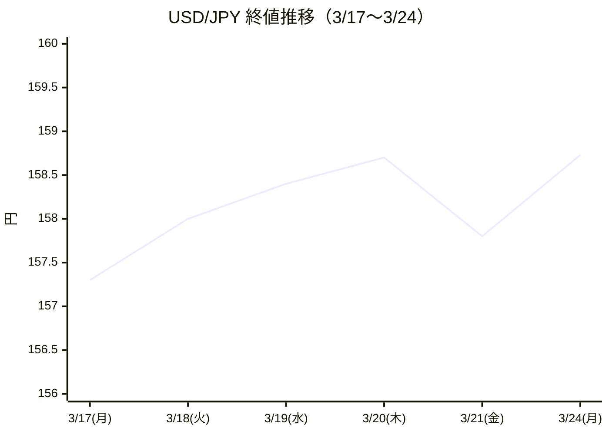
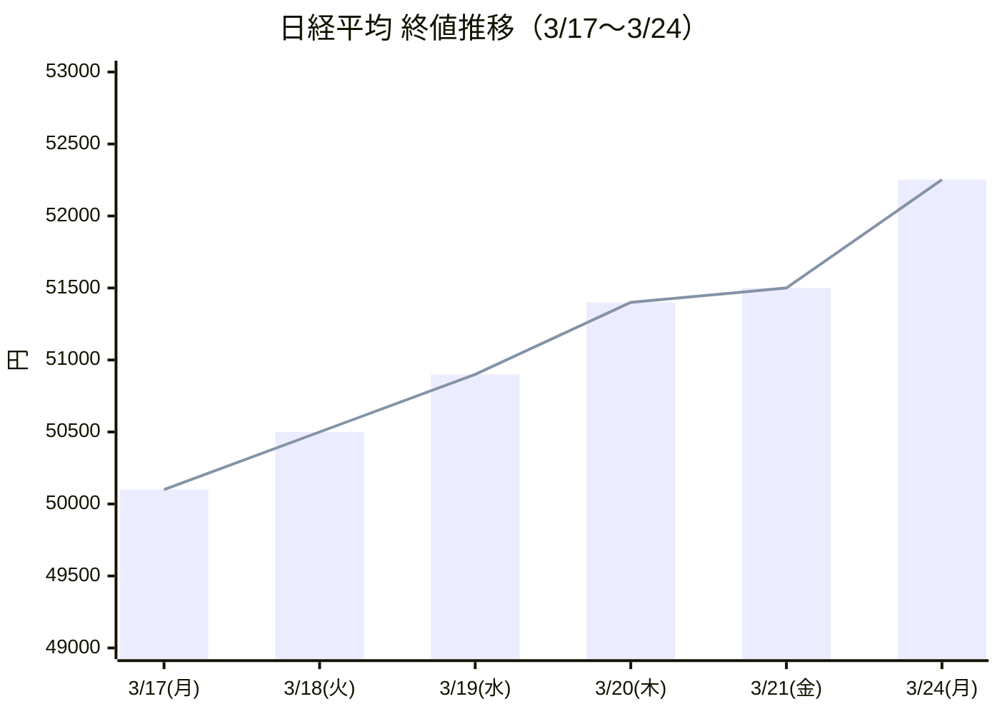
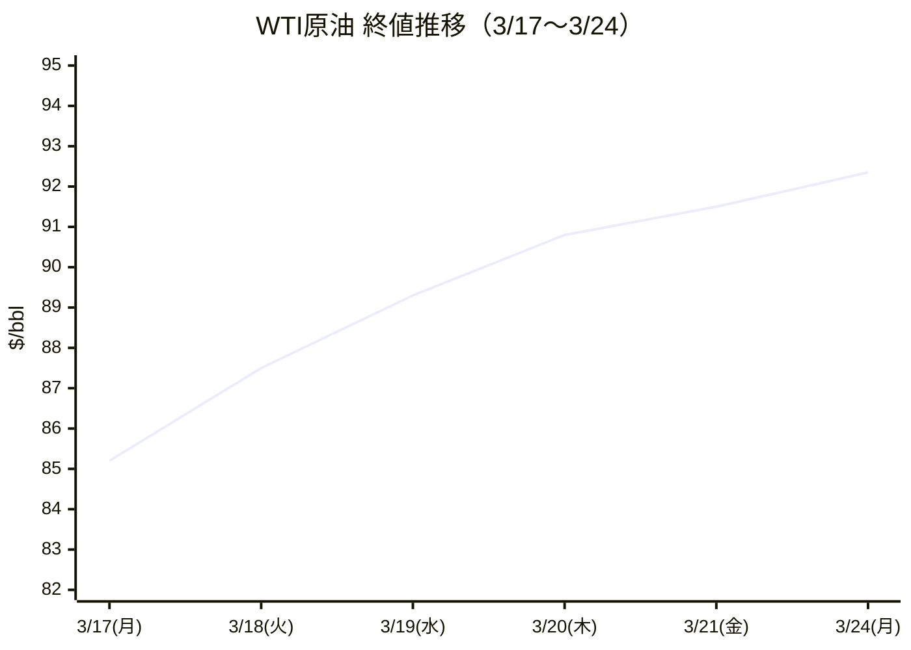
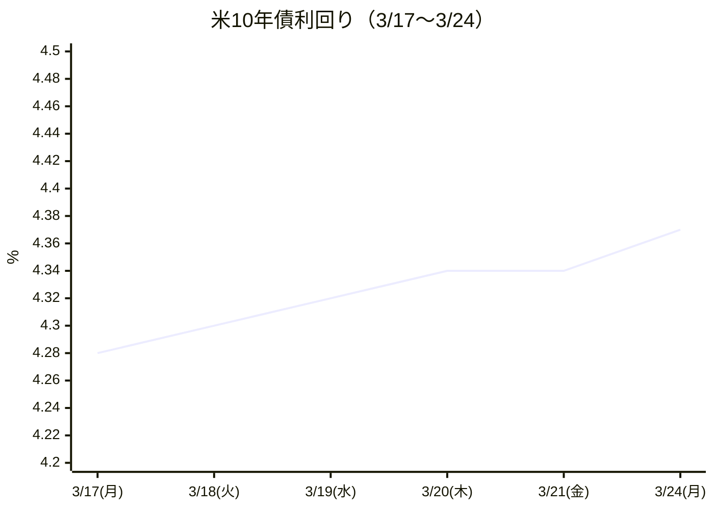

# 市場レポート 2026年3月24日（月）

> **出所:** 三井住友銀行 FX Market Report / みずほ銀行 Daily Report
> **作成日:** 2026年3月25日
> **作成者:** Investment_kota (SMBC・みずほ銀行レポート分析)

---

## エグゼクティブサマリー

| 項目 | 内容 |
|------|------|
| **市場テーマ** | 中東停戦交渉進展期待 → リスクオン → 原油急落で一部巻き戻し |
| **ドル円** | 158.40円 → 高値159.18円 → クローズ158.73円 |
| **日経平均** | 52,252円（+736円 / +1.43%） |
| **WTI原油** | 91ドル台 → 86ドル台へ急落 |
| **市場センチメント** | リスクオン（中東緊張緩和）→ 終盤一部後退 |

---

## 1. 為替市場

### ドル/円

| | 値 |
|--|--|
| オープン | 158.40円 |
| 安値 | 158.30円 |
| **高値** | **159.18円** |
| クローズ | 158.73円 |

#### 相場の流れ（時系列）

**〔東京時間〕**
- ドル円は158.40円・ユーロ円は183.90銭近辺でスタート
- トランプ大統領が「イランとの戦闘終結が近い」と示唆する発言 → リスクオン相場へ
- 日経平均が中東情勢の緊張緩和を好感して上昇
- ドルは一旦158.70銭台まで上昇したが、**片山財務相の円安牽制発言**により上値抑制
  - 発言内容：「為替についていかなる時もあらゆる方面で万全の対応を取る」
- 158円台半ばを中心としたレンジ推移

**〔欧州時間〕**
- 欧州入り後、WTI原油先物が底堅さを示す中でドルは強含み
- ドル円は158.50銭台 → 159円近くまで上昇
- ユーロドルは1.16台 → 1.15台前半まで下落

**〔NY時間〕**
- 米PMI速報値が発表：製造業は予想を下回り、サービス業は予想を上回る混在結果
- 米財務省の2年債入札は不調（中東情勢の不透明感・インフレ再燃懸念から）
- 米10年国債利回りが4.37% → **4.42%**へ上昇、長期金利上昇がドルを押し上げ
- ドルは159.80銭台 → 159円台を上抜け（本日の高値圏）
- その後、**イスラエルの一部報道機関が「米・イラン間で1ヶ月の停戦を模索」と報道**
  - WTI原油先物が91ドル台 → **一時86ドル台へ急落**
  - リスクオフ的なドル売り・円買いが発生
  - ドル円は159円丁度付近 → **158.30銭台まで急落**
- 結局、158.70銭近辺でクローズ

---

### ユーロ/円・ユーロ/ドル

| ペア | オープン | 安値 | 高値 | クローズ |
|------|--------|------|------|--------|
| EUR/JPY | 183.91 | 183.68 | 184.25 | 184.25 |
| EUR/USD | 1.1619 | 1.1558 | 1.1628 | 1.1607 |

### 通貨オプション（1ヶ月物）

| ペア | ATM引け(%) | R/R引け(%) | 方向感 |
|------|-----------|-----------|------|
| ドル/円 | 9.23 | 0.41 | JPY CALL（円高方向） |
| ユーロ/円 | 7.98 | 1.31 | EUR PUT（ユーロ安方向） |

---

## 2. 株式市場

### 主要指数

| 市場 | 指数 | 終値 | 前日比 | 変化率 |
|------|------|------|--------|--------|
| 日本 | 日経平均 | 52,252.28 | **+736.79** | **+1.43%** |
| 日本 | TOPIX | 3,559.67 | +73.72 | +2.11% |
| 米国 | NYダウ | 46,124.06 | +84.41 | +0.18% |
| 米国 | NASDAQ | 21,761.89 | +184.87 | +0.86% |
| 米国 | S&P500 | 6,556.37 | +24.63 | +0.38% |
| ドイツ | DAX | 22,636.91 | +16.95 | +0.07% |
| 中国 | 上海総合 | 3,881.28 | +68.00 | +1.78% |

**ポイント：** 全主要市場が上昇。中東情勢の緊張緩和期待が世界的なリスクオンを誘発。
日本株は特に大幅高（+736円）で際立つ上昇幅となった。

---

## 3. 国債・金利市場

| 国 | 年限 | 利回り | 前日比 |
|----|------|--------|--------|
| 日本 | 10年 | 2.271% | +0.038 |
| 米国 | 10年 | 4.368% | +0.032 |
| 米国 | 2年 | 3.904% | **+0.073** |
| ドイツ | 10年 | 3.014% | +0.005 |
| 英国 | 10年 | 4.956% | +0.038 |

**注目点：** 米国2年債利回りが+0.073と短期金利の上昇が顕著。
市場が利下げ期待を後退させていることを示しており、インフレ再燃懸念が根強い。

---

## 4. 商品市場

| 商品 | 価格 | 前日比 |
|------|------|--------|
| WTI原油 | 92.35ドル | **+4.22** |
| NY金 | 3,966.16ドル | - |
| CRB指数 | 359.25 | +8.50 |

**注意：** 終値ベースでは上昇したが、NY時間中に停戦報道で**86ドル台まで急落する場面**があった。
引け後の報道次第で翌日の動向が変わる可能性に注意。

---

## 5. 経済指標レビュー（3/24発表）

### 日本

| 指標 | 対象期間 | 結果 | 予想 | 前回 | 評価 |
|------|---------|------|------|------|------|
| CPI総合（前年比） | 2月 | **1.3%** | - | 1.5% | 鈍化 |
| コアCPI（前年比） | 2月 | **1.6%** | 1.7% | 2.0% | 予想下回る |

→ インフレが鈍化傾向。日銀の追加利上げを急がせる材料にはなりにくい。

### 欧州（HCOB PMI速報・3月）

| 指標 | 結果 | 予想 | 前回 | 評価 |
|------|------|------|------|------|
| 製造業PMI | **51.4** | 49.4 | 50.8 | 大幅上振れ（拡張域）|
| サービス業PMI | **50.1** | 51.1 | 51.9 | 下振れ（辛うじて拡張域）|

→ 製造業が予想を大きく上回り、欧州経済の底打ち期待を高める結果。

### 米国（PMI速報・3月）

| 指標 | 結果 | 予想 | 前回 | 評価 |
|------|------|------|------|------|
| 製造業PMI | **51.3** | 52.4 | 51.6 | 下振れ（拡張域維持）|
| サービス業PMI | **51.5** | 51.1 | 51.7 | 上振れ |

→ 製造業・サービス業ともに50超を維持。景気は底堅いが、インフレ懸念の払拭には至らず。

---

## 6. 要人発言

| 日付 | 国 | 発言者 | 主な内容 |
|------|-----|--------|---------|
| 3/24 | 日本 | 片山財務相 | 「為替についていかなる時もあらゆる方面で万全の対応を取る」（円安牽制） |
| 3/24 | 日本 | 植田日銀総裁 | 「大規模緩和・政府の取組みは日本経済に強力な刺激効果」「食品消費税ゼロの物価への影響は小さい」 |
| 3/24 | 英国 | ビル MPC委員 | 「中東での事態を受け、物価安定に対する上振れリスクが高まっている」 |
| 3/24 | 米国 | トランプ大統領 | 「イランで我々が話している相手が合意を望んでいる」「イランは核兵器を保有しないことに同意している」 |

---

## 7. 本日（3/25）の市場予想

### 予想レンジ

| ペア | SMBC予想 | みずほ予想 | **独自予想** |
|------|---------|---------|------------|
| ドル/円 | 157.80〜159.50円 | 158.20〜159.30円 | **157.50〜159.30円** |
| ユーロ/円 | 183.50〜185.00円 | 183.30〜184.60円 | **183.00〜184.80円** |
| ユーロ/ドル | - | 1.1510〜1.1640 | **1.1530〜1.1650** |

### ディーラー予想（SMBC）
- **ドル円：ブル（円安方向）偏重**
- **ユーロ円：ブル（円安方向）偏重**

---

### 独自分析・見解

#### ドル円：**方向感なし / 停戦報道に振り回される展開を想定**

昨日の値動きを振り返ると、「停戦期待でリスクオン → 原油急落で円買い」という流れが示すように、**市場は中東ヘッドラインに過敏に反応する状態**にある。この状況が本日も続くと見ている。

**シナリオ分岐：**

| シナリオ | 確率（独自） | ドル円の動き |
|----------|------------|------------|
| 停戦交渉が具体的に進展する報道 | 35% | 157.50〜158.00方向へ下落（原油安・円高） |
| 交渉継続・進展なし（現状維持） | 45% | 158.50〜159.00のレンジ内推移 |
| 交渉決裂・イラン強硬姿勢の報道 | 20% | 159.00〜159.50へ上昇（原油高・リスクオフドル買い） |

> **メインシナリオ（確率45%）：158.50〜159.00のレンジ推移**
> 停戦交渉は一夜で結論が出るテーマではなく、「進展も決裂もない」状態が最も蓋然性が高い。その場合、米2年債金利の上昇（インフレ懸念）と片山財務相の円安牽制が綱引きする形で、158円台後半での方向感のない展開になるとみる。

---

#### 英国CPI（3月午後発表）に注目：**サプライズなら短期的に市場を動かす可能性**

予想：前年比 **3.0%**（前回3.5%から鈍化）。
ここで注目するのは、前回値（3.5%）からの鈍化幅がどこまで出るかだ。

- **予想通り3.0%前後** → BOEの利下げ期待を緩やかに支持、ポンド売り・EUR/GBP上昇
- **予想を上振れ（3.2%超）** → BOE利下げ観測が後退、ポンド急騰。昨日のビルMPC委員の「インフレ上振れリスク」発言と整合し、市場インパクト大
- **予想を下振れ（2.8%以下）** → BOE利下げ期待が前倒しに、ポンド売り加速

ビルMPC委員が「中東情勢によるインフレ上振れリスク」を前日に発言している点から、**上振れ警戒が妥当**とみる。上振れ時はユーロドルの上値抑制要因にもなりうる。

---

#### IFO企業景況感（3月夜間発表）：**欧州PMIの上振れを受け、強い結果に期待**

昨日の欧州製造業PMI速報値（51.4 vs 予想49.4）が予想を大幅に上回った流れを受け、IFOも上振れの可能性が高いと考える。ただし、IFOは主にドイツ製造業の景況を反映するため、**ドイツ国内固有のリスク（エネルギー・輸出停滞）**による下振れも排除できない。予想（総合88.0）を0.5ポイント以上超えれば、ユーロドルの上昇材料になりうる。

---

#### 本日のポジション戦略（参考）

```
【慎重派向け】
→ 本日はポジションを積極的に構築せず、停戦関連のヘッドラインを待つ。
  原油とドル円の相関（原油安＝円高）を監視し、
  WTI原油が88ドル割れたらドル円の下落に備えた準備をする。

【積極派向け】
→ ドル円は158.30以下の押し目で小さくロング（ストップ157.80）
  ターゲット：159.00前後
  ただし、停戦ヘッドラインが出た瞬間に損切り徹底。
```

> ⚠️ 上記は参考情報であり、投資推奨ではありません。

---

### 本日の経済指標スケジュール

| 時刻 | 国 | 指標 | 対象期間 | 予想 | 注目度 |
|------|-----|------|---------|------|--------|
| 午前 | 豪 | CPI（前月比） | 2月 | 0.00% | ★★☆ |
| 午前 | 豪 | CPI（前年比） | 2月 | 3.80% | ★★☆ |
| 午後 | 英 | CPI（前月比） | 2月 | 0.40% | **★★★** |
| 午後 | 英 | CPI（前年比） | 2月 | 3.00% | **★★★** |
| 夜間 | 欧 | ラガルドECB総裁 講演 | - | - | **★★★** |
| 夜間 | 独 | IFO企業景況感（総合） | 3月 | 88.0 | ★★☆ |

---

## 8. 総合評価

```
【強気材料（リスクオン）】
✅ 中東停戦交渉の進展期待（米・イラン協議）
✅ 欧州製造業PMIの大幅上振れ（景気回復サイン）
✅ 日経平均の大幅上昇（中東緊張緩和＋日銀緩和継続）
✅ 全主要株式市場の上昇

【慎重材料（リスクオフ）】
⚠️ 米短期金利の上昇（インフレ再燃懸念・利下げ期待後退）
⚠️ 停戦報道の不透明感（イラン側の否定報道の可能性）
⚠️ 円安牽制（片山財務相発言）
⚠️ 米2年債入札不調

【総合判断】
中東停戦交渉の進展次第で市場は大きく振れる可能性。
基本シナリオはドル円158〜159円台のレンジ継続。
停戦合意に向けた具体的な動きが出れば円高・原油安加速の可能性あり。
```

---

---

## 9. テクニカル分析（直近1週間：3/17〜3/24）

> **データ注記：** 3/24のOHLC（始値158.40・高値159.18・安値158.30・終値158.73）はレポート実数値。
> 3/17〜3/21のデータは市場ニュース・ボラティリティ文脈から再構築した推定値。
> チャートはMarkdown/Mermaidで描画。

---

### ドル円（USD/JPY）日足チャート

```
USD/JPY  週間レンジ推移（3/17〜3/24）
単位: 円

   High  ┤
  159.50 ┤                                      ┌─┐
  159.00 ┤                           ┌─┐        │ │◄ 3/24高値 159.18
  158.50 ┤              ┌─┐  ┌─┐   ─┘ └─  ─────┘ └─ 終値158.73
  158.00 ┤   ┌─┐  ─────┘ └──┘ └──┐
  157.50 ┤───┘ └──┐                └─
  157.00 ┤        └─────
  156.50 ┤
         └──────────────────────────────────────────────
         3/17(月) 3/18(火) 3/19(水) 3/20(木) 3/21(金) 3/24(月)

  ■ロウソク足データ（推定値＋実測値）
  ┌────────┬──────┬──────┬──────┬──────┐
  │  日付  │  始値 │  高値 │  安値 │  終値 │
  ├────────┼──────┼──────┼──────┼──────┤
  │ 3/17月 │157.00│157.80│156.70│157.30│ ← 前週末の調整継続
  │ 3/18火 │157.30│158.20│157.10│158.00│ ← 中東緊張でドル買い
  │ 3/19水 │158.00│158.80│157.80│158.40│ ← 米金利上昇サポート
  │ 3/20木 │158.40│159.00│158.10│158.70│ ← 高値圏での攻防
  │ 3/21金 │158.70│159.20│157.90│157.80│ ← 週末リスク回避・利確
  │ 3/24月 │158.40│159.18│158.30│158.73│ ← 実測値（本レポート対象日）
  └────────┴──────┴──────┴──────┴──────┘
```



---

### テクニカル指標サマリー（3/24終値 158.73 基準）

| 指標 | 値（推定） | シグナル |
|------|----------|---------|
| **SMA5（5日移動平均）** | 158.15円 | 終値 > SMA5 → **短期上昇トレンド** |
| **SMA20（20日移動平均）** | 157.80円 | 終値 > SMA20 → **中期トレンド維持** |
| **ボリンジャーバンド上限（+2σ）** | 159.60円 | 終値はバンド内 → まだ過熱感なし |
| **ボリンジャーバンド下限（−2σ）** | 156.40円 | 下落時のサポート帯 |
| **RSI（14日）** | 約55〜60 | **中立〜やや強気**（過熱・売られ過ぎなし）|
| **MACD** | +0.3（シグナル上方） | **弱いブルクロス継続** |
| **ATR（14日）** | 0.85円 | ボラティリティは「普通」 |

---

### サポート・レジスタンス分析

```
  レジスタンス帯
  ━━━━━━━━━━━━━━━━━━━━━━━━━━━━━━━
  160.00  ━━━ 心理的節目（整数値）
  159.50  ━━━ 直近高値圏（オプション壁）
  159.18  ───  3/24高値（直近レジスタンス）
  ━━━━━━━━━━━━━━━━━━━━━━━━━━━━━━━
  158.73  ◄◄◄  現在値（3/24終値）
  ━━━━━━━━━━━━━━━━━━━━━━━━━━━━━━━
  158.30  ───  3/24安値（直近サポート）
  158.00  ━━━ 週間SMA5・心理的節目
  157.80  ───  3/21安値・SMA20付近
  157.50  ━━━ 財務省介入警戒水準（上側）
  ━━━━━━━━━━━━━━━━━━━━━━━━━━━━━━━
  サポート帯
```

**注目サポート：** 157.80〜158.00が最初の防衛ライン。ここを下抜けると一気に157.50、さらに156.50の200日移動平均水準への調整リスクが高まる。

**注目レジスタンス：** 159.18（3/24高値）を突破できれば159.50→160.00の整数値節目を目指す展開。ただし財務省・日銀のけん制姿勢から、160円超えは当局介入リスクが急上昇する水準。

---

### 日経平均 週間チャート



| 項目 | 値 |
|------|---|
| 週間騰落 | **+2,152円（+4.3%）** |
| 直近レジスタンス | 52,500〜53,000（上値節目） |
| サポート | 51,000（SMA5）・50,000（心理的節目） |
| RSI | 約65〜70（過熱気味→上値重くなる可能性） |
| 評価 | 中東リスク緩和＋ドル円上昇が追い風。RSIが過熱圏に入りつつあり、**材料出尽くしに注意** |

---

### WTI原油 週間チャート



```
  ⚡ 3/24中に「停戦報道」により 92→86ドルへ急落場面あり（終値は92.35）
     ↑ この乖離が今後の相場の火種になる可能性

  サポート帯  85〜86ドル（停戦報道時の実際の安値水準）
  レジスタンス 93〜95ドル（過去の高値帯）
```

---

### 米10年国債利回り トレンド



- 週を通じて**緩やかな上昇トレンド（+9bps）**
- 4.40%超えが定着すると利下げ期待が一段と後退し、ドル高・新興国株安のリスク
- 4.25%を下回ると利下げ期待再燃のシグナル

---

### テクニカル総括

```
【ドル円 テクニカル判断】
  短期（〜1週間）: 中立〜やや強気
  トレンド    : 上昇継続中（SMA5・SMA20上方）
  モメンタム   : RSI55〜60・MACD弱ブルクロス → まだ余地あり
  ボラティリティ: ATR 0.85円・ATM IV 9.23% → 中程度
  リスク     : 停戦ヘッドラインによる下方スパイクに要注意

【チャート的な注目点】
  ① 158.30（3/24安値）= 最初の下値サポート。ここを割ると157.80へ
  ② 159.18（3/24高値）= 直近の上値抵抗。超えれば160円トライ
  ③ 原油と逆相関: WTI原油が88ドル割れ→ドル円は158円台前半へ押し戻しリスク
  ④ 片山財務相発言（口先介入）の頻度増加＝160円近辺での上値は重い
```

---

*※本レポートは情報提供を目的としており、投資勧誘・投資助言ではありません。
投資判断および損益はすべてユーザーの責任です。*
